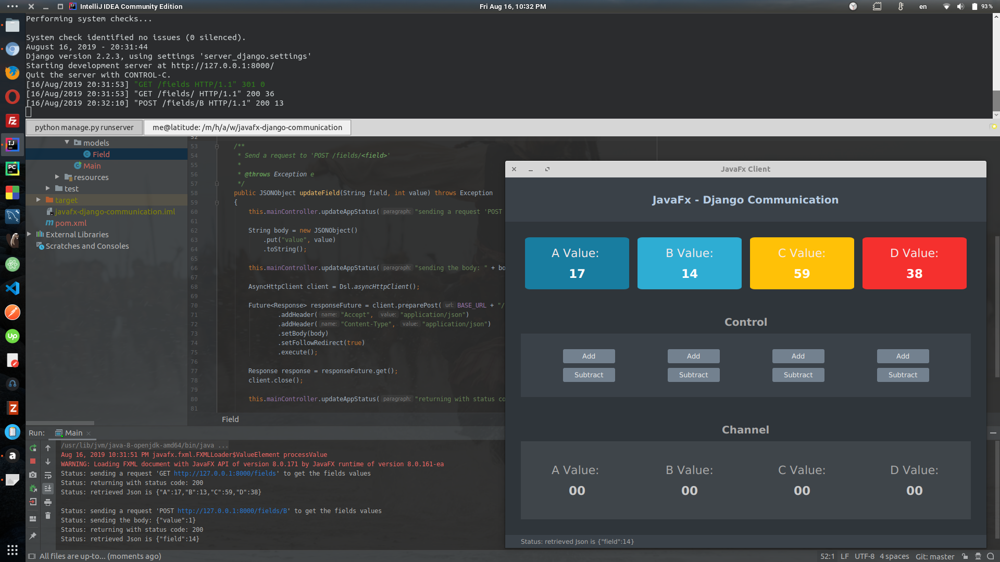

## Overview:
\- This is just a showcase of how to build half-duplex [HTTP] and full-duplex [web-socket] communications between a **`Django`** API and a **`Java`** Desktop application.

\- Feel free to copy, read, fork, or whatever you want.


---

## Usage:
##### :arrow_forward: server_django:
\- Make sure you have **`python3`**, **`Django`** installed in your machine. 

[click here]: https://docs.djangoproject.com/en/2.2/topics/install/

```bash
cd server_django

python manage.py migrate
python manage.py runserver
```

##### :arrow_forward: client_javafx directory:
\- Start the app, watch the console while playing with the add/subtract buttons.


---

## Screenshot:



<br />

بص .. دول الفايلات اللي بنجرب فيها

client_javafx/src/controller/MainController.java

client_javafx/src/models/Field.java

client_javafx/src/views/MainView.java

وده الفايل اللي عاوزك تبص عليه

client_javafx/src/models/Field.java

اول ميثود بتاعة `جيت انيشيال فاليوز` شغالة تمام

الميثود التانية `ابديت فيلد` بتبعت الريكوست من غير البودي

هو كدة احنا شغالين بالجافا من غير اي ليبراريز

دول 2 ليبراريز  لاقيتهم المفروض انهم بيسهلو الدنيا

https://hc.apache.org/httpcomponents-client-4.5.x/index.html

https://github.com/AsyncHttpClient/async-http-client

اول واحدة قعدت اجرب فيها و معرفتش ابعت حاجة

التانية مش عارف اتعامل معاها .. عشان تتضاف لازم نستخدم حاجات عيب

gradle و meaven

بس حاول تشغل التانية عشان فيها ويب سوكيت وده اهم حاجة

